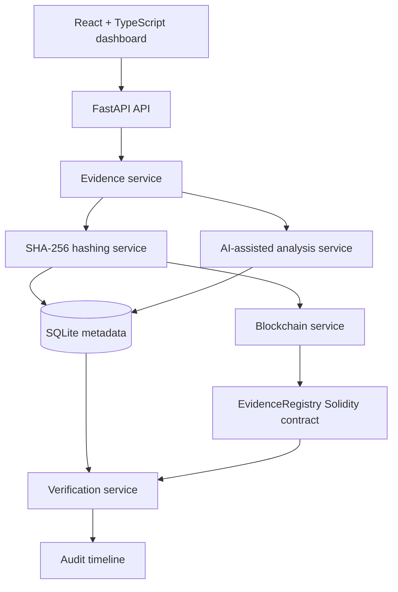

# SecureProof Architecture

SecureProof keeps uploaded evidence off-chain. The backend stores bytes in a generated internal filename and stores metadata, analysis, and verification records in SQLite. The only blockchain payload is a non-sensitive evidence identifier, a cryptographic hash, timestamp, and registering address.

The default `BLOCKCHAIN_MODE=memory` is an explicit offline development ledger for deterministic demos. It generates transaction-shaped values only inside that local adapter and labels them as development data. A production-like deployment must use an RPC adapter with `BLOCKCHAIN_RPC_URL`, `BLOCKCHAIN_PRIVATE_KEY`, `CONTRACT_ADDRESS`, and `CHAIN_ID`; no frontend secret is required or exposed.

Verification recalculates the current stored bytes, retrieves the original registered proof, compares the two hashes, and records an audit event. A match establishes byte-level consistency with the registered proof. It does not establish attribution, authorship, intent, or when an alteration occurred.
